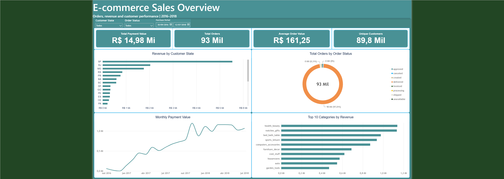
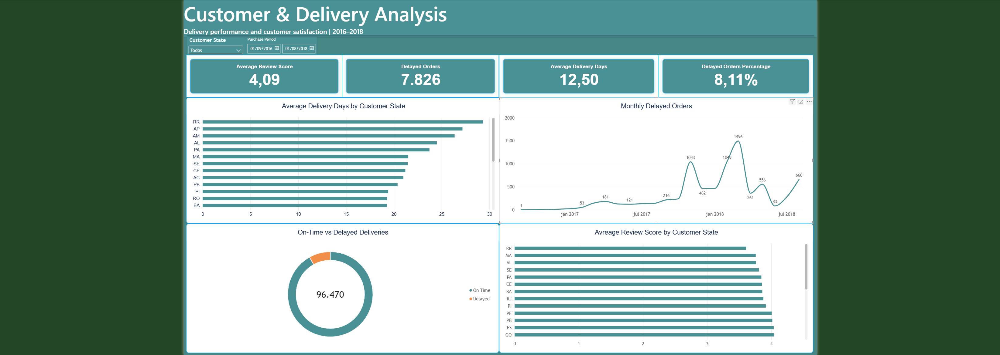

# E-commerce Sales & Customer Analytics

Projeto end-to-end de análise de dados de um e-commerce brasileiro, desenvolvido com PostgreSQL, SQL, Power Query, Power BI e DAX.

A solução transforma os arquivos brutos do dataset da Olist em um banco relacional validado, consultas de negócio, views analíticas e um dashboard interativo com indicadores de vendas, clientes, entregas e satisfação.

## Dashboard

### E-commerce Sales Overview



### Customer & Delivery Analysis



## Objetivo

Construir uma solução reproduzível de análise de dados capaz de responder perguntas como:

- Qual é o faturamento total e o ticket médio?
- Como pedidos e receita evoluem ao longo do tempo?
- Quais categorias de produtos geram mais receita?
- Quais estados concentram mais pedidos, clientes e receita?
- Quanto tempo as entregas levam em cada estado?
- Qual é o percentual de pedidos entregues com atraso?
- Como a satisfação dos clientes varia geograficamente?

## Principais resultados

- 99.441 pedidos analisados entre 2016 e 2018.
- 96.478 pedidos possuem status de entrega concluída.
- 96.470 entregas possuem datas suficientes para análise de prazo.
- 7.826 pedidos foram entregues após a data estimada, correspondendo a 8,11% das entregas avaliáveis.
- O tempo médio de entrega foi de 12,50 dias.
- A avaliação média dos clientes foi de 4,09 em uma escala de 1 a 5.
- As categorias com maior receita incluem `health_beauty`, `watches_gifts` e `bed_bath_table`.
- São Paulo concentra o maior volume de pedidos e receita, enquanto estados de menor volume apresentam, em geral, prazos médios de entrega maiores.

## Tecnologias

- PostgreSQL 18
- SQL
- Power Query
- Power BI
- DAX
- Git e GitHub

## Pipeline

1. Download dos nove arquivos CSV do dataset.
2. Criação do banco e das tabelas relacionais no PostgreSQL.
3. Carga dos dados com `\copy`, respeitando a ordem das chaves estrangeiras.
4. Validação de volume, qualidade e consistência dos dados.
5. Desenvolvimento de consultas SQL orientadas a negócio.
6. Criação das views `vw_order_summary` e `vw_product_sales`.
7. Transformação e modelagem no Power Query.
8. Criação de medidas DAX e construção do dashboard no Power BI.

## Modelo de dados

O banco possui nove tabelas:

| Tabela | Granularidade |
|---|---|
| `customers` | Cadastro de cliente associado a um pedido |
| `orders` | Um pedido |
| `order_items` | Um item dentro de um pedido |
| `order_payments` | Um pagamento de um pedido |
| `order_reviews` | Um registro de avaliação |
| `products` | Um produto |
| `sellers` | Um vendedor |
| `geolocation` | Uma coordenada associada a um prefixo de CEP |
| `product_category_translation` | Tradução de uma categoria de produto |

Algumas decisões de modelagem:

- `order_items` utiliza chave primária composta: `(order_id, order_item_id)`.
- `order_payments` utiliza chave primária composta: `(order_id, payment_sequential)`.
- `order_reviews` e `geolocation` utilizam chaves técnicas, pois os dados de origem não oferecem uma chave natural única confiável.
- CEPs são armazenados como texto para preservar zeros à esquerda.
- Valores monetários utilizam `NUMERIC(10,2)`.

## Validação dos dados

Os scripts de validação verificam:

- Quantidade de linhas carregadas em cada tabela;
- Distribuição dos pedidos por status;
- Datas ausentes no ciclo de entrega;
- Notas fora da faixa de 1 a 5;
- Produtos sem categoria;
- Categorias sem tradução;
- Repetições em avaliações;
- Pedidos sem pagamento;
- Pedidos entregues com datas ausentes.

A análise confirmou que o par `(review_id, order_id)` é único, embora cada coluna separadamente possua repetições.

## Análises SQL

As consultas em `sql/business-analysis/` cobrem:

1. Visão geral de vendas;
2. Tendência mensal de pedidos e receita;
3. Categorias de produtos com maior desempenho;
4. Vendas e clientes por estado;
5. Desempenho das entregas;
6. Satisfação dos clientes por estado.

As consultas usam recursos como:

- `JOIN` e `LEFT JOIN`;
- Agregações com `COUNT`, `SUM` e `AVG`;
- `COUNT(DISTINCT ...)`;
- `FILTER`;
- `DATE_TRUNC`;
- `COALESCE`;
- Ordenação, agrupamento e filtros de negócio.

## Views analíticas

O Power BI consome duas views preparadas no PostgreSQL:

- `vw_order_summary`: uma linha por pedido, com cliente, pagamento, entrega e avaliação.
- `vw_product_sales`: uma linha por item vendido, com produto, categoria, vendedor e valores.

Essa camada reduz transformações no Power Query e centraliza regras importantes no banco de dados.

## Estrutura do repositório

```text
.
├── data/
│   ├── raw/
│   └── processed/
├── database/
│   ├── load/
│   ├── schema/
│   ├── validation/
│   └── views/
├── docs/
│   └── images/
├── power-bi/
├── sql/
│   └── business-analysis/
├── .gitignore
└── README.md
```

Os arquivos CSV não são versionados devido ao tamanho e devem ser baixados separadamente.

## Como executar

### 1. Obter os dados

Baixe o [Brazilian E-Commerce Public Dataset by Olist](https://www.kaggle.com/datasets/olistbr/brazilian-ecommerce) e coloque os nove arquivos CSV em:

```text
data/raw/
```

### 2. Criar o banco e as tabelas

A partir da raiz do projeto:

```powershell
psql -U postgres -d postgres -f database/schema/00_create_database.sql
psql -U postgres -d ecommerce_analytics -f database/schema/01_create_core_tables.sql
psql -U postgres -d ecommerce_analytics -f database/schema/02_create_product_tables.sql
psql -U postgres -d ecommerce_analytics -f database/schema/03_create_order_items.sql
psql -U postgres -d ecommerce_analytics -f database/schema/04_create_payments.sql
psql -U postgres -d ecommerce_analytics -f database/schema/05_create_reviews.sql
psql -U postgres -d ecommerce_analytics -f database/schema/06_create_geolocation.sql
```

### 3. Carregar os dados

Execute os arquivos de `database/load/` em ordem numérica:

```powershell
Get-ChildItem .\database\load\*.sql |
    Sort-Object Name |
    ForEach-Object {
        psql -U postgres -d ecommerce_analytics -f $_.FullName
    }
```

### 4. Validar a carga

```powershell
Get-ChildItem .\database\validation\*.sql |
    Sort-Object Name |
    ForEach-Object {
        psql -U postgres -d ecommerce_analytics -f $_.FullName
    }
```

### 5. Criar as views

```powershell
psql -U postgres -d ecommerce_analytics -f database/views/01_create_analytics_views.sql
```

### 6. Abrir o dashboard

Abra:

```text
power-bi/ecommerce_analytics_dashboard.pbix
```

Atualize as credenciais da conexão PostgreSQL caso necessário.

## Dataset

O projeto utiliza o [Brazilian E-Commerce Public Dataset by Olist](https://www.kaggle.com/datasets/olistbr/brazilian-ecommerce), contendo aproximadamente 100 mil pedidos realizados entre 2016 e 2018, além de informações sobre clientes, produtos, vendedores, pagamentos, entregas, avaliações e geolocalização.

## Autor

Desenvolvido por [Lucas Eduardo](https://github.com/lucasedglima).
